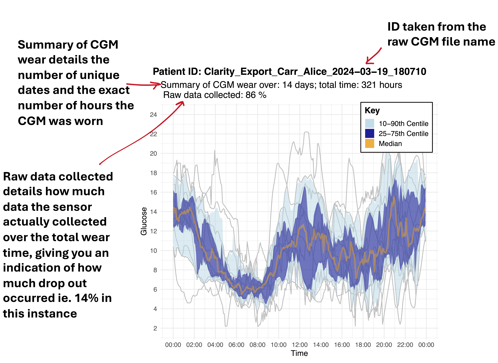

<!-- README.md is generated from README.Rmd. Please edit that file -->
<!-- badges: start -->
<!-- badges: end -->

___
# Installation

You can install the latest version of `CGMprocessing` directly from GitHub using the `remotes` package. First, make sure you have `remotes` installed:

```r
install.packages("remotes")
```
Then, you can install `CGMprocessing` using the following command:

```r
remotes::install_github("alicelouisejane/CGMprocessing")
```
If you encounter any issues during installation, please [open an issue](https://github.com/alicelouisejane/CGMprocessing/issues) on the GitHub repository page

___

The goal of `CGMprocessing` is to provide functions for preparing, cleaning and analyzing Continuous Glucose Monitoring (CGM) data for clinical diabetes studies. Glycemic variables and definitions are inline with the International Consensus on Use of Continuous Glucose Monitoring: [Danne 2017](https://care.diabetesjournals.org/content/40/12/1631) and [Battelino 2023](https://pubmed.ncbi.nlm.nih.gov/36493795/). This package also includes a specific function for use in the context of diabetes exercise studies, which splits up CGM into specific time periods post-exercise. Specific outputs are inline with CGM outputs in exercise recommendations in type 1 diabetes: [Riddell 2017](https://pubmed.ncbi.nlm.nih.gov/28126459/).

This code was developed based off work by [T. Vigers](https://journals.plos.org/plosone/article?id=10.1371/journal.pone.0216851)

This README is written as a tutorial for CGM analysis, including in the context of exercise. This an updated and more in depth explanation of the general pipeline that was developed and used in publishing a [PhD Thesis](https://www.proquest.com/openview/78089a4b4d1696754e7d2ae2b3e2e922/1?pq-origsite=gscholar&cbl=51922&diss=y) and [peer reviewed  research](https://academic.oup.com/jes/article/5/10/bvab127/6323320)

### Functions 
See parameters for explanations of the arguments per each function. You will find this in the man file on this GitHub: 

- [cleanCGM](#cleancgm)

- [exercise_split](#exercise_split)

- [analyseCGM output](#analysecgm)

- [intervention_split output](#intervention_split)

### Example File Structures
- **/data-raw**: raw data from sensor

Automatically created:

- **/data-clean**: data ran through _cleanCGM_ function or own cleaning pipeline to be inline with the format of a _cleanCGM_ output

- **/additional**: Folder for output csv of gap information and percentage expected wear information over the study output from _cleanCGM_ 

- **/graphs**: Folder of CGM trace graphs created when saveplot=T in _cleanCGM_

- **/data-....**: Folders for the split exercise files generated by _exercise_split_ [Jump to exercise_split output](#exercise_splitoutput) to see list of all folders created for each split time period

___

## <a id="intro"></a> Introduction to CGM analysis

___

❗**Important**: This package is optimized for raw Dexcom or Libre CGM data and can work with pre-aggregated clinical study CGM data. Raw CGM files usually have an ID number within the filename. If this is the case leave the filename as is. If raw files don't have this then edit the filenames so they are uniquely identified with the a subject ID number. If you are using already pre-aggregated data from another study  ie. [JAEB](https://public.jaeb.org/datasets/diabetes) you will need to ensure that your identification variable is a combination of the subject ID, visit number and device number to ensure everything is uniquely identified. If you are working with pre-processed data, or other CGM device types ensure you check data structures and edit code as appropriate to fit your needs❗

___

## <a id="cleancgm"></a> cleanCGM


**Functionality:** **cleanCGM()** is a function written to clean CGM data for simpler file outputs for further analysis. Variable names are standardized, high and low limits (sensor type dependent) converted from text to values, gaps identified and imputed with the last known glucose value **only if the gap is ≤20minutes**. Percentage wear/ sensor drop out information is calculated , including number of gaps and the total time imputed,and output in seperate files. Option for working with pre-aggregated data from clinical studies (**please read **[Introduction to CGM analysis](#intro)). Additional option for calibration if working with older sensor data.  

___

❗ **Important: If you don't want to use this function and want to clean your own data, but want to use _exercise_split_ or _analyseCGM_, then ensure data is in the the correct format see example at the end of the _cleanCGM_ section:** 
[Jump to cleanCGM output](#cleancgm-output)❗ 

- Function can take raw files from Dexcom, Libre or other (pre-aggregated data) from an input folder directory, or specified pre-aggregated file Files can be of any format, csv is preferred. **Important: Raw files should have subject ID/unique identifiers within filename _ID_optional.ext_ **

- If using raw data then devicetype will be combined with participant id from file name and to create the overall id variable in _cleanCGM_. This will be output as the ID in the cleaned file.
**NOTE: if using pre-aggrgated CGM data then your ID column _within_ the raw data file needs to already be formatted as _participant ID_visit number_device type_.**

- The output of the _cleanCGM()_ will give the final variable names as: **id**,**date** ,**timestamp**, **sensorglucose**

- Additional variables are required for cleaning steps but are not included in the final output of the clean file: **eventype**. This variable is to identifiy if the value was a sensor glucose value, a scan glucose value (libre 1 only) or other event. Cleaning filters for only sensor glucose values.   

**NOTE on gap filling**
- Gaps where the sensor has dropped out for 20 min or less are added into the timeseries where the glucose value is carried forward from the last known value. E.g. if working with data of 5 min intervals, a gap of 10 mins would mean adding in 1 row between the two timestamps where the drop out occurred, a gap of 15 min would mean adding 2 rows and 20 mins would mean adding 3 rows, each with the corresponding sequential timestamp and carried forward glucose value.     

**Table**: Definitions of the standardized variables

| Variable      | Definition                                                                                                                                      |
| ------------- | ----------------------------------------------------------------------------------------------------------------------------------------------- |
| id            | Subject ID taken from file name combined with the device ID for identification if different devices are occuring in one file (separated by "_") |
| date          | Date from timestamp                                                                                                                             |
| timestamp     | Sensor timestamp of glucose reading                                                                                                             |
| sensorglucose | Sensor glucose value                                                                                                                            |

### CGM variable dictionary

_cgmvariable_dictionary.xlsx_ included as part of this package is a dictionary used to rename variables of interest with standardization of the names from the raw CGM files (as above) without much user input. 

- Optional argument in _cleanCGM_ allows for custom CGM dictionaries to be used if the names of the raw data CGM files are different to what is pre-specified or you are using other sensors. Construct you dictionary exactly as below replacing the _old_vars_ with your raw CGM files variable names of interest that matches with the _new_vars_. Do not change the _new_vars_. Edit your _type_ of device and _expecteddaysofwear_ relavent to the lifetime of one of these sensors. for eg. A Dexcom g6/7 sensor lasts 10 days, a Libre sensor lasts 14 days.

**Table**: Example of dictionary for renaming old variables in raw CGM data files, edit as required. "Type" column in this dictionary is only for user only for reference, sensor type is specified as an argument in the function.Ensure you enter the lifetime of the sensor used. Example is of some variable names I have come across in each of the sensors- Always check you data to see what the variable names are and edit this dictionary. If you have a mixed download of CGM of files, I recommend separating into folders by sensor type to avoid confusion before processing. Additionally please note the use of ID_VISIT_DEVICEID in the type other. This is used to ensure unique identification in clinical study data that has been pre-aggregated. Device id is also kept for use in raw files, however if you purposefully have more than one device (ie a 30 day wear file) then this will not effect outputs of _analyseCGM_ but you must specify this. However, the **percentage_data_collected_info.xlsx** will be per unique device.   

| old_vars                        | new_vars      | type   | expecteddaysofwear |
| ------------------------------- | ------------- | ------ | ------------------ |
| Serial Number                   | deviceid      | libre  | 14                 |
| Device Timestamp                | timestamp     | libre  | 14                 |
| Historic Glucose(mmol/L)        | sensorglucose | libre  | 14                 |
| Record Type                     | eventtype     | libre  | 14                 |
| Source Device ID                | deviceid      | dexcom | 10                 |
| Timestamp (YYYY-MM-DDThh:mm:ss) | timestamp     | dexcom | 10                 |
| Glucose Value (mmol/L)          | sensorglucose | dexcom | 10                 |
| Event Type                      | eventtype     | dexcom | 10                 |
| ID_VISIT_DEVICEID               | id            | other  | 14                 |
| TIMESTAMP                       | timestamp     | other  | 14                 |
| GLUCOSE                         | sensorglucose | other  | 14                 |

#### Calibration
- This is an optional argument which is sensor dependent. Also some JAEB studies have CGM that had calibration requirements. **This requires the device argument to be set to "other" or "dexcomg4" if you are know you are using an old type of dexcom**. 

**How it works:** 

1) SMBG calibrations are matched to the closest CGM sensor value and compares them by absolute relative difference. Multiple calibrations are usually performed per day so the mean absolute relative difference (MARD) 
per day is generated. 

2) A day of data should not be used if the MARD exceeds 20%. These days are excluded. A MARD>20% has be chosen as many things can impact the MARD (ie. sensor glucose can trail behind blood glucose in periods of exercise, or it can just be inherent sensitivity of the CGM device used) and this is probably the upper limit of MARD that we could expect from some old devices [more info](https://www.ncbi.nlm.nih.gov/pmc/articles/PMC7189145/). 

3) Days that don't have calibrations (and should have done) are also excluded, however many studies that used CGM have the requirement in their protocol and hence if a patient didn't calibrate or meet the requirement of number of calibrations per day then their data is usually excluded from study.  

Newer sensors don't require calibrations and have internal algorithms that keep the glucose values "calibrated". 

If your sensor requires calibration the easiest way to handle these are to preprocess the data like some example studies in JAEB are formatted ie. [Wireless Innovation for Seniors with Diabetes Mellitus (WISDM)](https://pubmed.ncbi.nlm.nih.gov/28126459/) demonstrated in the example below. Calibrations work on having the calibration value identified in a record type variable. 

👷**Please Note** Preprocessed data structures may all be different, so this part may not work as expected. Please review code and data structures and edit your code as necessary. 👷

**Table**: Example head of data structures that have calibration values. All CGM and SMBG calibrations are put into the same column and identified by a eventtype variable. 

| id | timestamp           | eventtype   | sensorglucose |
| -- | ------------------- | ----------- | ------------- |
| 1  | 2000-06-30 14:49:36 | CGM         | 7.17          |
| 1  | 2000-06-30 14:54:36 | CGM         | 7.28          |
| 1  | 2000-06-30 14:59:36 | CGM         | 7.61          |
| 1  | 2000-06-30 15:04:36 | CGM         | 7.83          |
| 1  | 2000-06-30 15:09:36 | calibration | 7.9           |


#### <a id="cleancgm-output"></a> cleanCGM output

The function will output: 

- **Cleaned CGM files** of the structure:

| id | date       | timestamp           | sensorglucose |
| -- | ---------- | ------------------- | ------------- |
| 1  | 2000-06-30 | 2000-06-30 14:49:36 | 7.17          |
| 1  | 2000-06-30 | 2000-06-30 14:54:36 | 7.28          |
| 1  | 2000-06-30 | 2000-06-30 14:59:36 | 7.61          |
| 1  | 2000-06-30 | 2000-06-30 15:04:36 | 7.83          |

- **gap_info.csv** Which provides information on the gaps in the data. It contains the timestamp and length of gap (diff) per ID:

| id                    | gaptime                             | gapcount | timestamp            | diff |
| --------------------- | ----------------------------------- | -------- | -------------------- | ---- |
| 1_Visit 1_1MH0005DVGW | 2019-03-28 18:53:00 length: 30 mins | 1        | 2019-03-28T18:53:00Z | \-30 |
| 1_Visit 6_1MH000GN38W | 2019-10-10 21:56:00 length: 30 mins | 3        | 2019-10-10T21:56:00Z | \-30 |
| 1_Visit 6_1MH000GN38W | 2019-10-10 22:56:00 length: 30 mins | 3        | 2019-10-10T22:56:00Z | \-30 |
| 1_Visit 6_1MH000GN38W | 2019-10-12 04:26:00 length: 30 mins | 3        | 2019-10-12T04:26:00Z | \-30 |
| 2_Visit 7_1MH0019EM1H | 2020-07-04 03:51:00 length: 45 mins | 1        | 2020-07-04T03:51:00Z | \-45 |

- **percentage_data_collected_info.csv** Which provides information about the quality of the CGM data. This file will be per unique device. This is why device id is an important variable to keep. Variables described below:

  1. _percentage_expectedwear_overstudy_ -percentage wear that was expected over the study (usually expected lifetime of the sensor if it is a 10 day wear (dexcom) or 14 day wear (libre), but some studies might only require 3 days of wear, you can specify this in the function arguments). It evaluates the length of time from the maximum to minimum timestamp.
  
  2. _percentage_datacollected_overstudy_ -percentage of actual data collected. This tells us if there was drop out from the sensor, counting the amount of time that the CGM actually measured.
  
  3. _percentage_dropout_overstudy_ -percentage of time that was lost to drop out (inverse of the above)

| id                    | percentage_expectedwear_overstudy | totallosttime | percentage_datacollected_overstudy | percentage_dropout_overstudy |
| --------------------- | --------------------------------- | ------------- | ---------------------------------- | ---------------------------- |
| 1_Visit 1_1MH0005DVGW | 99.4047619                        | 0             | 100                                | 0                            |
| 1_Visit 6_1MH000GN38W | 99.4047619                        | 0             | 100                                | 0                            |
| 1_Visit 6_1MH000GN38W | 45.2380952                        | 0             | 100                                | 0                            |
| 1_Visit 6_1MH000GN38W | 99.4047619                        | 30            | 99.8511905                         | 0.14880952                   |

- **CGM traces graphed** When saveplot=T the graph as below is outputted with some information on the number of days present and number of hours this CGM was worn for (each line is a unique date). Also includes the amount of data the sensor actually collected over wear time, giving you an indication of the amount of sensor drop out. When dealing with combined clinial study data this graph will output for each individual in the study as well as for the overall cohort.  

  

___


___

## <a id="exercise_split"></a> exercise_split

**Functionality:** **exercise_split()** is a function written to split up a CGM file (cleaned by _cleanCGM_ or another way) into relevant time periods post exercise. Exercise splitting is based on an exercisefile- a list of exercise timestamps for every person in study [Jump to exercisefile - List of exercise time stamps ](#exercisefile-listofexercisetimestamps) for the structure of this. Function takes files in the same structure as outputted from [cleanCGM output](#cleancgm-output). These split files can then be individually ran through [analyseCGM](#analysecgm) or taken for further analysis. **This does not yet work with pre-aggregated data, this works with individual files as unique individuals per study time**  

___

In the diabetes exercise literature it is usual to assess:

- 6 hours post exercise (In this function you can alter the 6 hours to be any number of hours)

- Overnight post exercise (00:00-06:00)

- 24 hours post exercise

- The time from exercise end up until 00:00 

- The next day post exercise (06:00-24:00 ie. midnight of that next day)
              


#### <a id="exercisefile-listofexercisetimestamps"></a> exercisefile - List of exercise time stamps 
- File required for exercise splitting, listing the start and end time of each exercise. Type column can be changed to whatever type of exercise/event/instance etc. it is. 

It should be structured as below: 

| pt_id | type | startdatetime      | finishdatetime      |
| ----- | ---- | ------------------ | ------------------- |
| FRC1  | 1    | 2022-01-28 8:19:28 | 2022-01-28 9:34:28  |
| FRC1  | 2    | 2022-03-15 8:40:48 | 2022-03-15 9:50:48  |
| FRC2  | 1    | 2022-03-10 7:17:44 | 2022-03-10 8:32:44  |
| FRC2  | 2    | 2022-04-07 7:17:43 | 2022-04-07 8:27:43  |

#### <a id="exercise_splitoutput"></a> exercise_split output

- Folders holding each time period split are created automatically in your _outputdirectory_ as below:


- The files in this folder are named automatically corresponding to the time period they are in eg. files in **data-after_24**  are named as: _ID_exercisetype_24.csv_, for  **data-after_0000_0600** are named as: _ID_exercisetype_00_06.csv_ etc. 

❗ **Important:**  File naming structure is required for the _analyseCGM_ function. Creating a unique file for each individual for each time period allows us to get a global table of CGM metrics for each of these time periods which is easier to then taken on for further analysis.❗ 

- For ease the folder data-all are all the files in one folder. You can then point ot this one folder when you run _analyseCGM_. 

These files are structured slightly differently to the _cleanCGM_ output with the addition of the variables:

- **type**: relating to the type of exercise/event/instance of exercise etc	which is specified in the exercisefile
                    
- **start_split**: Sensor glucose timestamp where the split began ie. the closest within the CGM interval that matched the start of exercise	
                    
- **startdatetime**: Exercise start timestamp from exercise file

- **finishdatetime**: Exercise end timestamp from exercise file	

- **diff**: The raw time difference between the sesnsor glucose timestamp **exercise end timestamp**. If negative this is **during** exercise.	

- **diff_disc**: The discrete time interval created from the diff variable. During exercise is set to 0 and follows consecutively ie. time within the first hour after exercise is set to 1, second hour is 2 etc. 
                    
❗ **Important:** _analyseCGM_ when exercise=T relies on the **diff_disc** variable to create the time in range during exercise and post exercise metrics.❗                     


| timestamp       | sensorglucose | pt_id | type | start_split     | startdatetime   | finishdatetime  | diff        | diff_disc |
| ------------------- | ----------------- | --------- | -------- | ------------------- | ------------------- | ------------------- | ---------------- | ------------- |
| 2022-03-16 00:00:49 | 4.3               | FRC1      | cooldown | 2022-03-15 09:50:48 | 2022-03-15 08:40:48 | 2022-03-15 09:50:48 | 14.1669444444444 | 15            |
| 2022-03-16 00:05:49 | 4.3               | FRC1      | cooldown | 2022-03-15 09:50:48 | 2022-03-15 08:40:48 | 2022-03-15 09:50:48 | 14.2502777777778 | 15            |
| 2022-03-16 00:10:49 | 4.7               | FRC1      | cooldown | 2022-03-15 09:50:48 | 2022-03-15 08:40:48 | 2022-03-15 09:50:48 | 14.3336111111111 | 15            |
| 2022-03-16 00:15:49 | 5                 | FRC1      | cooldown | 2022-03-15 09:50:48 | 2022-03-15 08:40:48 | 2022-03-15 09:50:48 | 14.4169444444444 | 15            |


Also output are:

- **exercisecharacterisitcs.xlsx** which is a summary of just the exact sensor glucose at the start and end time of exercise


- **all_CGM.csv** which is all data from everyone with respect to exercise as below: 

   
___

## <a id="intervention_split"></a> intervention_split

___

**Functionality:** **intervention_split()** a more generic version of exercise_split, it is a function written to split up a CGM file (cleaned by _cleanCGM_ or another way) into before or after identified time(s) of intervention. Intervention splitting is based on an interventionfile- a list of dates of an intervention for every person in study [Jump to interventionfile - List of intervention dates ](#interventionfile-listofinterventiondates) for the structure of this. Function takes files in the same structure as outputted from [cleanCGM output](#cleancgm-output). The resulting split files can then be individually ran through [analyseCGM](#analysecgm) or taken for further analysis. This function works for pre-aggregated data if specificed in the funcitons parameters.


#### <a id="interventionfile-listofinterventiondates"></a> interventionfile - List of intervention dates 
- File required for intervention splitting, listing the date of each intervention and specifying the type of intervention. Intervention column assigns the labels in the resulting files so ensure it is something you can understand. All patients can be in this one file. Enter dates in chosen standardized date format.

It should be structured as below: 

| id        | intervention | date          |
| --------- | ------------ | ------------- |
| patient_1 | transplant1  | Aug 18 2022   |
| patient_1 | transplant2  | Mar 08 2023   |
| patient_2 | transplant1  | Sept 18 2022  |
| patient_2 | transplant2  | Mar 20 2023   |
| patient_2 | transplant3  | April 18 2024 |

#### <a id="intervention_splitoutput"></a> intervention_split output

- Folders of data-before_intervention and data-after_intervention

- If data was not pre aggregated, files will be of each individual ID with the intervention type specified in the filenames. This is also repeated in the id column within the file. This will allow _analyseCGM()_ to create metrics for the specific times before or after intervention for each ID. (if data was preaggregated it will be the same but all within one file of before intervention and after intervention). 

___

## <a id="analysecgm"></a> analyseCGM

___

**Functionality:** **analyseCGM()** is a function written to create consensus glycemic metrics based off definitions outlined International Consensus on Use of Continuous Glucose Monitoring:[Danne 2017](https://care.diabetesjournals.org/content/40/12/1631) [Battelino 2023](https://pubmed.ncbi.nlm.nih.gov/36493795/). For definitions [Jump to analyseCGM output](#analysecgm-output). Function takes files in the same structure as outputted from _cleanCGM_ or  _exercise_split_. 

___

- For calculation of time spent variables data is checked to be consecutive. If timestamps are >20 min apart a missing row is added to the table to prevent events from running on if the time gap is >20 min. Gaps in the data are identified by _cleanCGM_ (if used) and a summary file is outputted- [Jump to cleanCGM output](#cleancgm-output).

- General time spent variables are created for: 
  - Above 10, 13.9, 16
  - Below 3 
  - Range 3-<3.9, 3.9-10
  
  
- In addition to this hypo/hyperglycemia also have defined "excursions":
  - Hyperglycemia (at levels >10 and >13.9 and 16)
  - Hypoglycemia (clinical excursion event beginning when <3 for 15min and ending when ≥3.9 for 15min) 

The start of an excursion is when glucose goes above/below the specified value for 15 mins. If this doesn't happen it is not defined as an excursion and isn't included in the _excursion time spent variables_. The _general time spent variables_ will include any time above/below the level regardless of if this is >15min. 

🖋️ **NOTE** it is my recommendation that the _general time spent variables_ are sufficient and the defined excursions or "clinical excursion" hypoglcemia are too stringent. You may miss important information if you just assess events that had to last >15min. This is particularly relevant if you use the Libre 1, 2 or Libre pro as this CGM measures glucose every 15min. Using general time above/below as your measures of hypo/hyperglycemia would give you a good indication of the lived experience of a patient and this, in my opinion, is most important. Excursion metrics are still required by the International Consensus on Use of Continuous Glucose Monitoring and hence why this function still generates them 🖋


#### Hypoglycemia (clinical excursion event beginning <3 for 15min and ending when >3.9 for 15min)

**Beginning of a CGM event**: readings below 3 mmol/l for 15 min defines a clinically significant hypoglycemic event. Code checks if 4 consecutive rows are below 3 (4 rows in total: row 1 detected below 3mmol/l the next 3 rows = a time of 15 mins as 1 row is assumed as a 5 min reading). If this is the case then the first instance of dropping below 3 is marked as the start row of the clinical hypoglycemia CGM event.

**End of a CGM event**: readings for 15 min at ≥ 3.9 mmol/l. From the start row of the true hypoglycemic event defined above the code checks if the glucose in consecutive rows is ≥ 3.9 mmol/l and marks these values as hypoglycemia. At the row glucose becomes ≥ 3.9 the code checks if the next 3 rows remain ≥ 3.9 mmol/l (4 rows in total: row 1 detected ≥ 3.9 mmol/l the next 3 rows = a time of 15 mins as 1 row is assumed as a 5 min reading). If glucose dips below 3.9 again within these 4 rows then the event does not end. If the glucose stays ≥ 3.9 for these 4 rows the event ends at the first instance of ≥3.9. 

If a missing row is present (inserted because the consecutive timestamps had a gap >20 min) the hypoglycemic event has to end at this point).
🖋️

#### Freestyle libre in the analyseCGM() function 
- If the data you have are from a Libre below generation 3 (or any sensor that has 15min sampled data) then ensure your argument _libre_ is set to TRUE in the analyseCGM() function. 

- The _analyseCGM_ function has a section that pseudo codes this kind of data to be "5min" data ie. Every row is repeated 2 more times (3 lots of 5 mins are in 15 mins). It doesn't matter that the timestamps aren't increasing by 5 min but having the number of rows corresponding to 5 min data is the important part, mainly for the clinical hypo excursion definition. Gaps in the data will still be identified as normal, as the repeated rows are only for the rows that were present in the data. Code section as below:

```r
  table <- slice(table, rep(1:n(), each = 3))
```
- Additionally this ensures the true interval is tracked and inputted correctly in the output file

#### <a id="analysecgm-output"></a> analyseCGM output

1) A .csv file called by default _CGMupload_ containing CGM variables per each individual on each row 

All CGM variables generated by _analyseCGM_ are detailed below. For each individual, variables are generated automatically for all time, day time hours only and night time hours only: 

| Output variable                | Description                                                                                                                                                                                                                                                                                                                                                  |
| ------------------------------ | ------------------------------------------------------------------------------------------------------------------------------------------------------------------------------------------------------------------------------------------------------------------------------------------------------------------------------------------------------------ |
| time_of_day                    | Defines if CGM variables are summarising all time, day time hours only or nighttime hours only. There will always be 3 rows per individual                                                                                                                                                                                                                   |
| subject_id                     | Taken from the ID column of the cleaned CGM data file loaded (in the format output from the cleanCGM function. Subject ID combined with device ID if analysesensorlifetime was set to TRUE. If set to FALSE this will just give the subject ID with the device id removed.                                                                                   |
| exercise                       | Value of TRUE or FALSE determines if these metrics are analysed in the context of post exrcise time periods. Only created when exercise=T. See section on exercise analysis for more info                                                                                                                                                                    |
| hourspostexercise              | Numeric of number of the user defined time period  to analyse post exercise. Default is 6 hours. Only created when exercise=T. See section on exercise analysis for more info                                                                                                                                                                                |
| start_cgm_analysis             | Minimum datetime in table                                                                                                                                                                                                                                                                                                                                    |
| end_cgm_analysis               | Maximum datetime in table                                                                                                                                                                                                                                                                                                                                    |
| interval                       | Most common interval in the data, for dexcom this is 300 seconds (5min) for libre this is put to 900 seconds (15 min)                                                                                                                                                                                                                                        |
| num_days_cgmwear               | Number of unique dates in the file. Accurate percentage wear and and sensor drop out information can be found in the percentage_data_collected_info.csv output from cleanCGM                                                                                                                                                                                 |
| num_hours_cgmwear              | Time difference from the max date to the min date. Accurate percentage wear and and sensor drop out information can be found in the percentage_data_collected_info.csv output from cleanCGM                                                                                                                                                                  |
| totaltime_mins                 | Total time in the table in minutes , this is calculated from the number of rows present multipled by the time interval, NOT max and min as this would not be accurate if there were gaps in the data. Accurate percentage wear and and sensor drop out information can be found in the percentage_data_collected_info.csv output from cleanCGM               |
| totaltime_hours                | Total time in the table in hours, this is calculated from the number of rows present multipled by the time interval, NOT max and min as this would not be accurate if there were gaps in the data. Accurate percentage wear and and sensor drop out information can be found in the percentage_data_collected_info.csv output from cleanCGM                  |
| total_sensor_readings          | Total number of rows in the table                                                                                                                                                                                                                                                                                                                            |
| average_sensor                 | Average sensor glucose                                                                                                                                                                                                                                                                                                                                       |
| estimated_a1c%                 | Estimated HbA1c in % based on HbA1c equation and mean glucose                                                                                                                                                                                                                                                                                                |
| estimated_a1cmmolmol           | Estimated HbA1c in mmol/mol based on hba1c equation and mean glucose                                                                                                                                                                                                                                                                                         |
| gmimmol/mol                    | Glucose Management Indicator mmol/mol inndicates the average Hba1C level that would be expected based on mean.  GMI and estimated HbA1c should therefore be similar                                                                                                                                                                                          |
| gmi%                           | Glucose Management Indicator % inndicates the average Hba1C level that would be expected based on mean.  GMI and estimated HbA1c should therefore be similar                                                                                                                                                                                                 |
| q1_sensor                      | Lower quartile sensor glucose                                                                                                                                                                                                                                                                                                                                |
| median_sensor                  | Median sensor glucose                                                                                                                                                                                                                                                                                                                                        |
| q3_sensor                      | Upper quartile sensor glucose                                                                                                                                                                                                                                                                                                                                |
| standard_deviation             | Standard deviation of sensor glucose                                                                                                                                                                                                                                                                                                                         |
| cv                             | Coefficient of variation. SD is highly influenced by the mean glucose – someone with a higher mean glucose will have a higher SD. The CV divides the SD/mean x100. This division helps “correct” and normalize glucose variability, allowing us to set a single variability goal that applies to people with different mean glucose levels.                  |
| min_sensor                     | Minimum sensor glucose                                                                                                                                                                                                                                                                                                                                       |
| max_sensor                     | Maximum sensor glucose                                                                                                                                                                                                                                                                                                                                       |
| excursions_over_10             | Count of number of times glucose went above 10 mmol/l for 15 mins (excursion start defined as above  threshold fpr 15 mins)                                                                                                                                                                                                                                  |
| min_spent_excursion_over_10    | Time in mins spent in excursions above 10 mmol/l (excursion start defined as above threshold fpr 15 mins)                                                                                                                                                                                                                                                    |
| percent_time_excursion_over_10 | Percentage of time spent in excursions above 10 mmol/l in relation to total time of the sensor calculated previously   (excursion defined as above  threshold fpr 15 mins)                                                                                                                                                                                   |
| excursions_over_13             | Count of number of times glucose went above 13.9 mmol/l for 15 mins (excursion start defined as above  threshold fpr 15 mins)                                                                                                                                                                                                                                |
| min_spent_excursion_over_13    | Time in mins spent in excursions above 13.9 mmol/l (excursion start defined as above threshold fpr 15 mins)                                                                                                                                                                                                                                                  |
| percent_time_excursion_over_13 | Percentage of time spent in excursions above 13.9 mmol/l in relation to total time of the sensor calculated previously   (excursion defined as above  threshold fpr 15 mins)                                                                                                                                                                                 |
| excursions_over_16             | Count of number of times glucose went above 16 mmol/l for 15 mins (excursion start defined as above  threshold fpr 15 mins)                                                                                                                                                                                                                                  |
| min_spent_excursion_over_16    | Time in mins spent in excursions above 16 mmol/l (excursion start defined as above threshold fpr 15 mins)                                                                                                                                                                                                                                                    |
| percent_time_excursion_over_16 | Percentage of time spent in excursions above 16 mmol/l in relation to total time of the sensor calculated previously  (excursion defined as above  threshold fpr 15 mins)                                                                                                                                                                                    |
| hypo_under_3_prolonged         | Count of number of times hypoglycemic episode (as defined see below) was > 2 hours                                                                                                                                                                                                                                                                           |
| hypo_under_3                   | Count of number of hypoglycemic episodes. Clinically significant hypoglycemic event excursion begins as readings below 3 mmol/l for 15 min, ending when readings for 15 min at ≥ 3.9 mmol/l. See below NOTE for more information.                                                                                                                            |
| min_spent_under_hypo3          | Time in mins spent in hypoglycemia episode                                                                                                                                                                                                                                                                                                                   |
| percent_time_under_hypo3       | Percentage of time spent in hypoglycemic episodes in relation to total time of the sensor calculated previously                                                                                                                                                                                                                                              |
| min_spent_<3                   | Time in mins spent below 3 mmol/l                                                                                                                                                                                                                                                                                                                            |
| percent_time_<3                | Percentage of time spent below 3 mmol/l in relation in relation to total time of the sensor calculated previously                                                                                                                                                                                                                                            |
| min_spent_3_3.8                | Time in mins spent between  3-3.9 mmol/l                                                                                                                                                                                                                                                                                                                     |
| percent_time_3_3.8             | Percentage of time spent between 3-3.9 mmol/l in relation in relation to total time of the sensor calculated previously                                                                                                                                                                                                                                      |
| min_spent_3.9_10               | Time in mins spent between  3.9-10 mmol/l                                                                                                                                                                                                                                                                                                                    |
| percent_time_3.9_10            | Percentage of time spent between 3.9-10 mmol/l in relation in relation to total time of the sensor calculated previously                                                                                                                                                                                                                                     |
| min_spent_3.9_7.8              | Time in mins spent between  3.9-7.8 mmol/l                                                                                                                                                                                                                                                                                                                   |
| percent_time_3.9_7.8           | Percentage of time spent between 3.9-7.8 mmol/l in relation in relation to total time of the sensor calculated previously                                                                                                                                                                                                                                    |
| min_spent_over10               | Time in mins spent above 10 mmol/l                                                                                                                                                                                                                                                                                                                           |
| percent_time_over10            | Percentage of time spent above 10 mmol/l in relation in relation to total time of the sensor calculated previously                                                                                                                                                                                                                                           |
| min_spent_over13               | Time in mins spent above 13.9 mmol/l                                                                                                                                                                                                                                                                                                                         |
| percent_time_over13            | Percentage of time spent above 13.9  mmol/l in relation in relation to total time of the sensor calculated previously                                                                                                                                                                                                                                        |
| total_auc                      | Total area under the glucose curve                                                                                                                                                                                                                                                                                                                           |
| r_mage                         | Mean Amplitude Glycemic Excursion. MAGE is an arithmetic average of either the upward or downward of all glycemic excursions exceeding the threshold (standard deviation of blood glucose obtained from all blood glucose concentrations within 24-hour period). Option to asses average of the differences greater than either  entire dataset SD, 2SD, etc |
| j_index                        | J index is a measure of quality of glycemic control based on the combination of information from the mean and SD calculated as 0.001 × (mean + SD) doi: 10.1055/s-2007-979906.                                                                                                                                                                               |
| conga_1                        | Continuous overlapping net glycemic action, with \_n appended as the indicated number of hours being assessed (in this case 1 hour). CONGA(n) represents the SD of all valid differences between a current observation and an observation (n) hours earlier. doi:10.1089/dia.2005.7.253                                                                      |
| modd                           | The mean of daily differences (MODD) index provides an estimation of interday glycemic variability. This parameter is calculated as the mean of absolute differences between glucose values at corresponding time points of consecutive days. Doi: 10.1007/BF01218495                                                                                        |
| lbgi                           | Low Blood Glucose Index, equation is for glucose in mmol/l (dc1386 appendix). The LBGI is a specific indicator for hypoglycemia as well as the trend toward hypoglycemic excursions and provides a continuous measure for estimating hypoglycemic risk                                                                                                       |
| hbgi                           | High Blood Glucose Index, equation is for glucose in mmol/l (dc1386 appendix). The HBGI is a specific indicator for hyperglycemia as well as the trend toward hyperglycemia excursions and provides a continuous measure for estimating hyperglycemia risk                                                                                                   |
| min_spent_7_15_exercise        | Only created when exercise=T. Time in mins spent between 7-15 mmol/l during exercise doi: 10.1016/S2213-8587(17)30014-1 (Riddell 2017)                                                                                                                                                                                                                       |
| percent_time_7_15_exercise     | Only created when exercise=T. Percentage of time in mins spent between 7-15 mmol/l during exercise doi: 10.1016/S2213-8587(17)30014-1 (Riddell 2017)                                                                                                                                                                                                         |
| min_spent_5_12_exercise        | Only created when exercise=T. Time in mins spent between 5-12 mmol/l in the time up to 6 hours post exercise doi: 10.1016/S2213-8587(17)30014-1 (Riddell 2017)                                                                                                                                                                                               |
| percent_time_5_12_exercise     | Only created when exercise=T. Percentage of time in mins spent between 5-12 mmol/l in the time up to 6 hours post exercise doi: 10.1016/S2213-8587(17)30014-1 (Riddell 2017)                                                                                                                                                                                 |


#### <a id="exercise"></a> Exercise
Set argument exercise is set to TRUE. Analysis of exercise data is usually done for time periods post exercise. If you are using this function on exercise data, structured as periods of CGM data that are a certain time post exercise, ensure your files are structured as [outputted from the exercise_split function](#exercise_split)

- Additional CGM metrics are created for exercise and are defined in [ analyseCGM output](#analysecgm-output)
- _min_spent_7_15_exercise_

- _percent_time_7_15_exercise_

- _min_spent_5_12_exercise_

- _percent_time_5_12_exercise_

___


